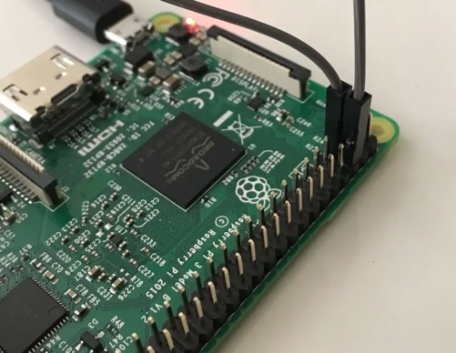

# SHUTDOWN AND WAKEUP BUTTONS

## WAKE UP BUTTON

There is no need for any script for a Raspberry Pi to wake up from a halt.
Simply short-circuiting two specific GPIO pins will result in the Pi waking up.

The button we have created will have to be hooked up to the 5th pin (GPIO3) and the 6th pin (Ground). The 5th pin is the only pin for starting up devices from a sleeping mode. The ground pin can be any of the other ground pins. Only the shutdown option is available without using the 5th (because perhaps you have some configuration for other peripherals).



## SLEEP / SHUTDOWN FUNCTIONALITY

Starting and shutting down the Pi is possible in numerous ways. Often,  this is done by creating an infinite loop that gets
interrupted with the button press.
However, this is a waste of resources as the loop will constantly run in the background as fast as possible.
You could add a delay to the loop, so it  loops on an interval; however, we have an even better way of solving this
issue built in the GPIO library.
We will use some functionality from the GPIO library, which has inbuilt edge detection.
This method is relatively simple while being elegant and functional. The script will execute on the detection of a falling edge.

First, we need to packages, update first and get them after:

`sudo update`
`sudo apt-get install RPi.GPIO`
`pip install subprocess.run`

Create a new file:

`sudo nano listen_shutdown.py`

Paste this script into the file and save it:

```python
#!/usr/bin/env python

import RPi.GPIO as GPIO
import subprocess

GPIO.setmode(GPIO.BCM)
GPIO.setup(3, GPIO.IN, pull_up_down=GPIO.PUD_UP)
GPIO.wait_for_edge(3, GPIO.FALLING)

subprocess.call(['shutdown', '-h', 'now'], shell=False)
```

Now to start this script from startup, we need to move the file and make it executable:

`sudo mv listen_shutdown.py /usr/local/bin/`
`sudo chmod +x /usr/local/bin/listen_shutdown.py`

Now we need a 2nd file that will start and stop our service:

`sudo nano listen_shutdown.sh`

Put this in the file and save it:

```python
#! /bin/sh

### BEGIN INIT INFO
# Provides:          listen_shutdown.py
# Required-Start:    $remote_fs $syslog
# Required-Stop:     $remote_fs $syslog
# Default-Start:     2 3 4 5
# Default-Stop:      0 1 6
### END INIT INFO

# If you want a command to always run, put it here

# Carry out specific functions when asked to by the system
case "$1" in
  start)
    echo "Starting listen_shutdown.py"
    /usr/local/bin/listen_shutdown.py &
    ;;
  stop)
    echo "Stopping listen_shutdown.py"
    pkill -f /usr/local/bin/listen_shutdown.py
    ;;
  *)
    echo "Usage: /etc/init.d/listen_shutdown.sh {start|stop}"
    exit 1
    ;;
esac

exit 0
```

We need to move this file again to the right location and make it executable:

`sudo mv listen_shutdown.sh /etc/init.d/`
`sudo chmod +x /etc/init.d/listen_shutdown.sh`

One more command to make the script run on boot:

`sudo update-rc.d listen_shutdown.sh defaults`

We can perform one more command to make the script start right now so we don't have to restart
 first:

`sudo /etc/init.d/listen_shutdown.sh start`

Test the button. It should shut the Pi down and boot it back up from a halt state.
