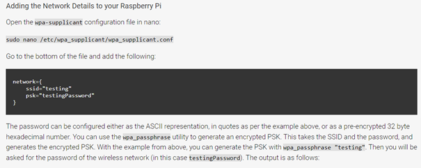
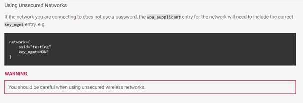
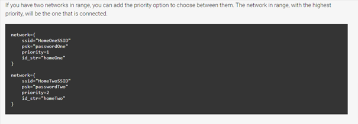

# Network configuration Raspberry Pi

READ BEFORE YOU START:
THIS DOCUMENT CONSISTS OF MULTIPLE PARTS AND WE ADVISE YOU TO FAMILIARIZE YOURSELF WITH ALL PARTS.  

Contents:

``` bash
- Setting up `wpa_supplicant.conf` to connect our Pi to multiple access points

- Set up of our network

- Setting up an access point of our own (The easy way)

- Setting up an access point of our own (The regular way)
```

## To connect our Raspberry Pi's to multiple networks

This configuration makes it easier for your Pi to connect to multiple networks. Below is the documentation is described how
to set up an access point (so others can connect to your Pi) needed for the assignment.

### The command line method (fastest)

Adding the Network Details to your Raspberry Pi
Open the wpa-supplicant configuration file in nano:

`sudo nano /etc/wpa_supplicant/wpa_supplicant.conf`

note:
_remember to save, close, and `sudo service networking restart` for .conf files to work_

[How Raspberry specifies in documentation](https://www.raspberrypi.com/documentation/computers/configuration.html)

note:
_Check de hashing password functie. Deze misschien nodig als de .conf toegankelijk is (wat niet zou moeten in ons systeem)_



For unsecured networks :



WHAT YOU NEED:



So you will end up with something like:

``` yaml
# Giving configuration update rights to wpa_cli
ctrl_interface=/run/wpa_supplicant
update_config=1
country=NL

# network section generated by wpa_passphrase
network={
    SSID=[hva]
    key_mgmt=NONE
}
network={
    SSID=[YOUR NETWORK]
    psk=[YOUR PASSWORD]
}


```

###################################################################################################################

## SETTING UP YOUR RASPBERRY PI AS AN ACCESS POINT

It is essential to understand that you are making a **network** in a **network**. For devices to be
found in these networks, well, we learned all about IP addresses.

Here is where you will put your newfound lessons into practice. Below is a general overview of a straightforward working
solution. This setup enables an easy way to set up your private network within an existing network.
The key is that the internet connection is forwarded by the laptop (WLAN) and passed down to the Raspberry Pi through a
physical cable (eth0). The Raspberry Pi can now use its WiFi adapter to be configured as an access point for other devices
and handing IP addresses of its own.  

###################################################################################################################

## Setting up a Routed Wireless Access Point

To set up the Raspberry Pi wireless access point we will be making the use of two packages. These two packages are `hostapd` and `dnsmasq`. `hostapd` is the package that allows us to utilize a Wi-Fi device as an access point, in our case, we will be utilizing this to turn the Raspberry Pi 3’s Wi-Fi into our access point.

`dnsmasq` acts as both a DHCP and DNS server so that we can assign IP addresses and process DNS requests through our Raspberry Pi itself.

Remember for this you will need to be utilizing an **ethernet**  network connection and not your Wi-Fi connection.

1. Before we get started installing and setting up our packages, we will first run an update on the Raspberry Pi by running the following two commands.

```yaml
sudo apt update 
sudo apt upgrade -y
sudo reboot
```

2. With that done we can now install our two packages, run the following command to install hostapd and dnsmasq.

`sudo apt install hostapd dnsmasq`

3. Stop the packages from running by utilizing the following two commands in the terminal. These commands will tell the system manager to stop the dnsmasq and hostapd services.

```yml
sudo systemctl stop hostapd
sudo systemctl stop dnsmasq
```

4. With hostapd and dnsmasq now stopped we will want to modify our `dhcpd` configuration so that we can take control of the `wlan0` interface.

With this file, we will be setting ourselves a `static` IP Address as well as telling it not to make use of the `wpa_supplicant` file so we can configure it purely as an access point to our device.

Run the following command on your Raspberry Pi to begin modifying the dhcpcd.conf file.

`sudo nano /etc/dhcpcd.conf`

5. Within this file we need to add the following line to the bottom, this will set up our `wlan0` interface to the way we want it for our tutorial.

```yaml
interface wlan0
    static ip_address=192.168.220.1/24
    nohook wpa_supplicant
```

Now save and quit out of the file by pressing `Ctrl +X` then pressing `Y` and then Enter.

6. Now we need to restart our dhcpd service so it will load in all our configuration changes. To do this run the following command to reload the dhcpd service.

`sudo systemctl restart dhcpcd`

7. Next, we adjust our hostapd configuration, edit the config file with the following command.

`sudo nano /etc/hostapd/hostapd.conf`

and :

```yml
interface=wlan0
driver=nl80211

hw_mode=g
channel=6
ieee80211n=1
wmm_enabled=0
macaddr_acl=0
ignore_broadcast_ssid=0

auth_algs=1
#wpa=2
#wpa_key_mgmt=WPA-PSK
#wpa_pairwise=TKIP
#rsn_pairwise=CCMP

# This is the name of the network

ssid=Flight-IFES

# The network passphrase

#wpa_passphrase=pimylifeup
```

Now we can save and quit out of the file by pressing `Ctrl +X` then pressing `Y` and then Enter.

9. We need to edit two other files. These files are what hostapd will read to find our new configuration file.

To begin editing the first of these two files run the following command.

`sudo nano /etc/default/hostapd`

10. In this file, we need to find the following line and replace it.

Find:

`# DAEMON_CONF=""`

Replace with:

`DAEMON_CONF="/etc/hostapd/hostapd.conf"`

Now save and quit out of the file by pressing `Ctrl +X` then pressing `Y` and then Enter.

11. Edit the second configuration file, this file is located within the `init.d` folder. Use the following command:

`sudo nano /etc/init.d/hostapd`

12. In this file, we need to find the following line and replace it.

Find:

`DAEMON_CONF=`

Replace with:

`DAEMON_CONF=/etc/hostapd/hostapd.conf`

Now save and quit out of the file by pressing `Ctrl +X` then pressing `Y` and then Enter.

13. With `hostapd` now set up, we need to move onto setting up `dnsmasq`. Before we begin editing its configuration file we will rename the current one as we don’t need any of its current configurations.

We can do this with the following mv command on our Raspberry Pi.

`sudo mv /etc/dnsmasq.conf /etc/dnsmasq.conf.orig`

14. Now that the original configuration file has been renamed we can begin by creating our own new configuration file. We will create and edit the new file with the nano command.

`sudo nano /etc/dnsmasq.conf`

15. To this file add the following lines.

These lines tell the dnsmasq service how to handle all the connections coming through and what interface it should be handling them for.

```yml
interface=wlan0       # Use interface wlan0  
server=1.1.1.1       # Use Cloudflare DNS  
dhcp-range=192.168.220.50,192.168.220.150,12h # IP range and lease time
```

Now we can save and quit out of the file by pressing Ctrl + X then pressing Y and then Enter.

16. Next, we need to configure your Raspberry Pi so that it will forward all traffic from our wlan0 connection over to our ethernet connection.

First, we must enable it through the sysctl.conf configuration file, so let’s begin editing it with the following command.

sudo nano /etc/sysctl.conf

17. Within this file, you need to find the following line and remove the # from the beginning of it.

Find:

# net.ipv4.ip_forward=1

Replace with:

`net.ipv4.ip_forward=1`

18. Now since we are impatient and don’t want to wait for it to enable on next boot we can run the following command to activate it immediately.

`sudo sh -c "echo 1 > /proc/sys/net/ipv4/ip_forward"`

19. With IPv4 Forwarding now enabled we can configure a NAT between our wlan0 interface and our eth0 interface. Basically, this will forward all traffic from our access point over to our ethernet connection.

Run the following commands to add our new rules to the iptable.

sudo iptables -t nat -A POSTROUTING -o eth0 -j MASQUERADE

20. The iptable is flushed on every boot of the Raspberry Pi so we will need to save our new rules somewhere so they are loaded back in on every boot.

To save our new set of rules run the following command.

sudo sh -c "iptables-save > /etc/iptables.ipv4.nat"

21. Now with our new rules safely saved somewhere we need to make this file be loaded back in on every reboot. The most simple way to handle this is to modify the rc.local file.

Run the following command to begin editing the file.

sudo nano /etc/rc.local

22. Now we are in this file, we need to add the line below. Make sure this line appears above exit 0. This line basically reads the settings out of our iptables.ipv4.nat file and loads them into the iptables.

Find:

exit 0

Add above “exit 0”:

iptables-restore < /etc/iptables.ipv4.nat

```

Now save and quit out of the file by pressing `Ctrl +X` then pressing `Y` and then Enter.

23. Finally, all we need to do is start the two services and enable them in `systemctl`. Run the following two commands.

```yml
sudo systemctl unmask hostapd
sudo systemctl enable hostapd
sudo systemctl start hostapd
sudo service dnsmasq start
sudo reboot
```

Enjoy your Access Point
